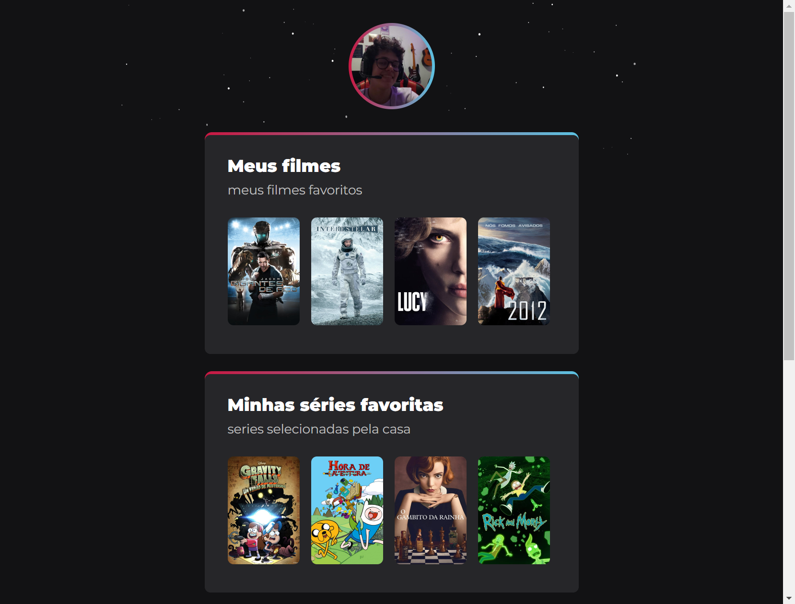

# Projeto SB

Projeto teste, aplicando conceitos de HTML, Css, Git e Github para criar um site semelhante a um projeto anterior

> [clique aqui para acessar](https://foionova.github.io/Projeto-SB/)

## ⚙️ Ferramentas Utilizadas ⚙️ ##
- Html
- Css
- Git
- Github

## Contato 💜 ##

> rafaelfelixsouza943@gmail.com
